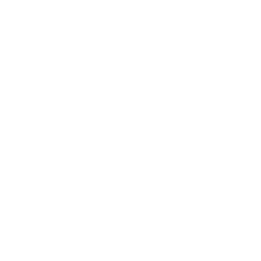

# D&amp;D 5e DM tools

<b>What is this?</b>

This is a web app (being) made for Dungeons and Dragons 5th Edition Dungeon Masters. Made with Angular.
Please keep in mind that this is still under development, and nowhere near done.

LIVE DEMO: <a href="https://gijspost.nl/dmtools">https://gijspost.nl/dmtools</a>

<b>Features</b>
<h5>Features</h5>
<ul>
    <li>A list of all monsters in the SRD with the ability to add your own.</li>
    <li>A list of all spells in the SRD and some other open sources (Elemental Evil, etc).</li>
    <li>An encounter tracker in which you can conveniently track initiative during combat, including hp and allies.</li>
    <li>Multiple party set-ups that are importable and exportable</li>
    <li>A neat little dice roller in the sidebar that works on user-specified input, like '1d20' or even '40d100'</li>
</ul> 
<h6>Disclaimer</h6>
<i>D&D 5e DM Tools is unofficial Fan Content permitted under the Fan Content Policy. Not approved/endorsed by Wizards. Portions of the materials used are property of Wizards of the Coast. ©Wizards of the Coast LLC.</i> 
<i>All rules, monsters, and spells in this app are part of the <a href="https://media.wizards.com/2016/downloads/DND/SRD-OGL_V5.1.pdf">D&D 5e SRD and licensed under the Open Gaming License (OGL)</a>.</i> 
<i>The logo and other images used in this app are from <a href="http://game-icons.net">game-icons.net</a> and licensed under CC BY 3.0.</i> 
<b>How to install</b>
<ul>
    <li>Download or Clone this repo.</li>
    <li>Make sure you have <a href="https://docs.npmjs.com/getting-started/installing-node#installing-npm-from-the-nodejs-site">Node.JS and npm</a> installed. Aswell as the <a href="https://cli.angular.io/">angular-cli</a>. Without these, you can't run the project.</li>
    <li>Open the project folder in cmd.exe, PowerShell or any terminal (<a href="https://www.google.com/search?source=hp&ei=CxAMW5T7Ccr2kwXPu4ywBg&q=how+to+open+a+folder+in+cmd&oq=how+to+open+a+folder+in+cmd">?</a>), and run <code>npm install</code>. This will install all necessary packages for the project automatically as defined in the package.json file.</li>
    <li>After npm is done installing all dependencies, run <code>ng serve --open</code>. This might take a while on the first try, so hold your horses. You only need to run this command if you want to start it up again after you've already done step 1 to 3 before.</li>
    <li>Tada! You should see the webapp open in your browser.</li>
    <li>To stop the process, simply close the browser window and then in your terminal press <code>CTRL + C</code> and then type 'yes' when asked to terminate the program.</li>
</ul> 
<b>Notes</b>

If the application is hard to run and you don't understand it, i'm sorry. Perhaps it is best if you have some experience with running angular projects when using this app. You can use the live demo online on my domain, but i cannot guarantee full up-time and latest releases. That said, the app doesn't use an api, it loads its two main data files (monsters.json / spells.json) from the assets folder. Maybe when I put this app online somewhere I will link an api to it, so I can remotely update the monster database. This web app is not optimalized for mobile (yet) so I highly recommend using a normal desktop browser.
